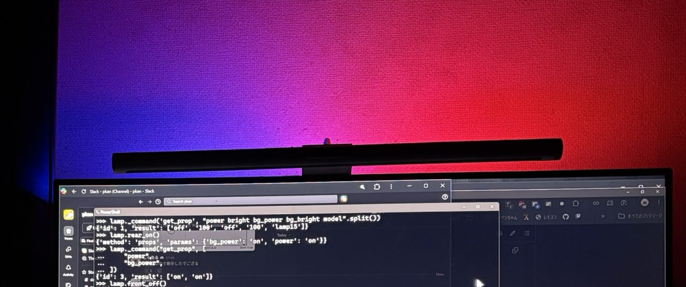

# python-yeelight-lamp15

only specific Yeelight LED Screen Light Bar Pro (lamp15 / YLTD003) control



## sample usage

```python
>>> from lamp15 import Lamp15
>>> lamp = Lamp15('192.168.0.218')
>>> lamp.rear_off()
{'method': 'props', 'params': {'bg_power': 'off'}}
>>> lamp.rear_on()
{'id': 2, 'result': ['ok']}
>>> lamp.segments((255, 0, 0), (0, 0, 255))
{'id': 3, 'result': ['ok']}
```
